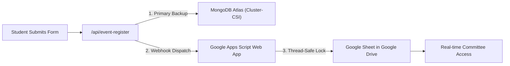

# Google Drive & Google Sheets Integration Guide (Handling 400+ Registrations)

This guide provides the complete, production-hardened setup to connect your CSI website forms to **Google Drive** and **Google Sheets** for handling **400+ registrations** smoothly without collisions, race conditions, or dropped submissions.

---

## 🏗️ Architecture Overview



---

## Step 1: Create the Target Google Sheet in Google Drive

1. Go to [Google Drive](https://drive.google.com).
2. Inside your desired CSI folder, click **+ New** → **Google Sheets**.
3. Name the sheet: `CSI KKWIEER - Event Registrations 2026`.
4. In **Row 1**, set these 9 column headers:

| A | B | C | D | E | F | G | H | I | J | K | L |
|---|---|---|---|---|---|---|---|---|---|---|---|
| **Ticket ID** | **Event Name** | **Full Name** | **Email** | **Contact Number** | **Department** | **Year** | **Sessions Attending** | **UPI ID / UTR** | **College / PRN** | **Payment Proof URL** | **Timestamp** |

---

## Step 2: Add Thread-Safe Google Apps Script (With LockService)

When 400 students register, multiple students may click submit simultaneously. Standard scripts can drop rows or clash. The script below uses `LockService.getScriptLock()` to queue concurrent requests safely.

1. In your Google Sheet, click **Extensions** → **Apps Script**.
2. Replace all code with the following:

```javascript
/**
 * CSI KKWIEER Event Registration Webhook
 * Handles concurrent student submissions safely using LockService.
 * Perfectly mapped to your 12 Google Sheet columns:
 * [Ticket ID, Event Name, Full Name, Email, Contact Number, Department, Year, Sessions Attending, UPI ID / UTR, College / PRN, Payment Proof URL, Timestamp]
 */
function doPost(e) {
  // 1. Script Lock to prevent race conditions during traffic spikes
  var lock = LockService.getScriptLock();
  try {
    lock.waitLock(20000);
  } catch (lockError) {
    return ContentService.createTextOutput(
      JSON.stringify({ status: "error", message: "Server busy, please retry" })
    ).setMimeType(ContentService.MimeType.JSON);
  }

  try {
    var sheet = SpreadsheetApp.getActiveSpreadsheet().getActiveSheet();
    var data = {};

    // Parse JSON payload
    if (e && e.postData && e.postData.contents) {
      data = JSON.parse(e.postData.contents);
    } else if (e && e.parameter) {
      data = e.parameter;
    }

    var ticketId = data.ticketId || "VW26-" + Math.floor(1000 + Math.random() * 9000);
    var eventTitle = data.eventTitle || data.event || "Vision Week 2026";
    var fullName = data.fullName || "N/A";
    var email = data.email || "N/A";
    var contact = "'" + (data.contactNumber || data.phone || "N/A"); // Prefix with ' to preserve leading zero
    var dept = data.department || "N/A";
    var year = data.year || "N/A";

    var sessions = "All Sessions";
    if (Array.isArray(data.selectedSessions) && data.selectedSessions.length > 0) {
      sessions = data.selectedSessions.join(", ");
    } else if (data.track) {
      sessions = data.track;
    }

    var upiId = data.upiId || "N/A";
    
    var collegePrn = data.college || "";
    if (data.prn) {
      collegePrn = collegePrn ? collegePrn + " (PRN: " + data.prn + ")" : "PRN: " + data.prn;
    }
    if (!collegePrn) collegePrn = "KKWIEER";

    var screenshot = data.paymentScreenshot || data.paymentProofUrl || "N/A";
    var timestamp = new Date().toLocaleString("en-IN", { timeZone: "Asia/Kolkata" });

    // 2. Append directly to Google Sheet (12 Columns)
    sheet.appendRow([
      ticketId,        // Col A: Ticket ID
      eventTitle,      // Col B: Event Name
      fullName,        // Col C: Full Name
      email,           // Col D: Email
      contact,         // Col E: Contact Number
      dept,            // Col F: Department
      year,            // Col G: Year
      sessions,        // Col H: Sessions Attending
      upiId,           // Col I: UPI ID / UTR
      collegePrn,      // Col J: College / PRN
      screenshot,      // Col K: Payment Proof URL
      timestamp        // Col L: Timestamp
    ]);

    return ContentService.createTextOutput(
      JSON.stringify({ status: "success", ticketId: ticketId })
    ).setMimeType(ContentService.MimeType.JSON);

  } catch (error) {
    return ContentService.createTextOutput(
      JSON.stringify({ status: "error", message: error.toString() })
    ).setMimeType(ContentService.MimeType.JSON);
  } finally {
    lock.releaseLock();
  }
}
```

---

## Step 3: Deploy as Web App

1. Click the blue **Deploy** button (top right) → **New deployment**.
2. Click the gear icon ⚙️ next to "Select type" → choose **Web app**.
3. Configure:
   - **Description**: `CSI Registrations Webhook 400`
   - **Execute as**: `Me (your Google account)`
   - **Who has access**: **`Anyone`** *(Essential so the website server can post entries)*
4. Click **Deploy**.
5. Authorize permissions when prompted.
6. Copy the **Web App URL** (looks like `https://script.google.com/macros/s/AKfycb.../exec`).

---

## Step 4: Add to `.env.local`

In your project root, open `.env.local` and add:

```env
GOOGLE_SCRIPT_WEBAPP_URL=https://script.google.com/macros/s/YOUR_COPIED_ID_HERE/exec
```

---

## Step 5: Instant CSV Export for Attendance

Even if Google Drive is offline or slow, all 400 registrations are automatically backed up in **MongoDB Atlas** (`event_registrations` collection).

The committee desk can download an Excel-ready CSV anytime at:
- `http://localhost:3000/api/export-registrations`
- Or filtered by event: `http://localhost:3000/api/export-registrations?eventId=e-yantran-2026`
